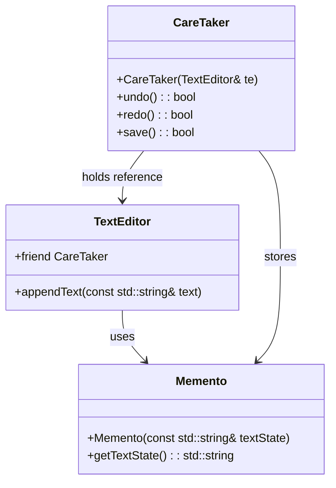
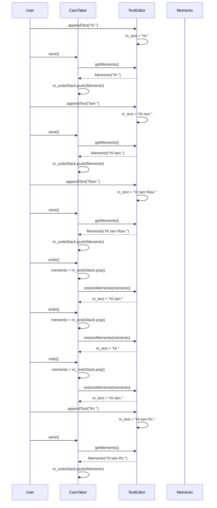

# Memento Pattern
Helps to store and retrieve state of objects with out revealing details of its implementation.

## Example of memento
Below TextEditor use case is consider, where user should be able to undo and redo the functionality.

## Use case
- Undo functionality in text editor.
- There should be a mechanism to store the contents of document every time when user adds text to documents.
- This would only work if the object has relaxed access restriction.

## Problems
- (Privacy) In realtime many props are declared under private access specifier.
- (Maintainability) Even if props are having public access specifier, in future if there is refactoring effort in extending the functionality of the class then developer is forced to modify copying logic for newly added objects.

## Solution
- Using memento will help to store and retrieve the state of object's internal state without violating encapsulation
-  Actors of memento includes,
	* **Originator** - Class whose states need to be persisted / subset of states need to be persisted.
	* **CareTaker** - Class who stores the list of memento, gets help from originator to create memento instance and add them to its list. Client interact which this class to restore the state of Originator & to save new memento to list.
	* **Client** - User who wants to save object state and retrieve the object state.
	* **Memento** - Class which is created by Originator, contains states of Originator. Note: This can include all the states or subset of states for originator.

## When to use memento
- Undo the state of object. Redo is not explicitly mentioned because executing same function will act as redo.
- Transaction rollback use cases.
- When state change is minimal.
- Support features like versioning / checkpointing.
- Caching states for lookups

## When not to use memento
- Persisting large object states.
- frequent state changes.
- immutable objects - if objects have immutable objects there is no point in storing the states. This is because immutable objects are often easily reconstructable.
- Complexity in understanding codebase.

## Class Diagram

## Sequence Diagram

